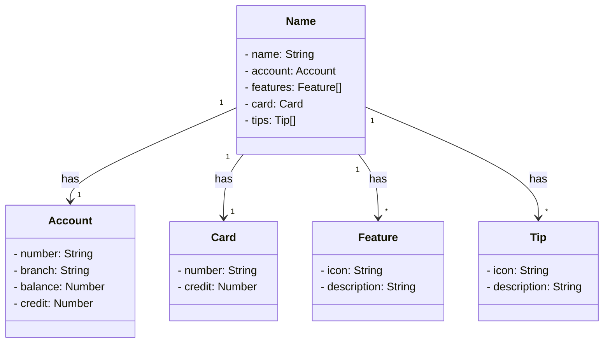

# DESAFIO DIO SANTANDER

Java RESTFull API.

### DIAGRAMA DE CLASSES

```mermaid
classDiagram
class Name {
- name: String
- account: Account
- features: Feature[]
- card: Card
- tips: Tip[]
}

    class Account {
        - number: String
        - branch: String
        - balance: Number
        - credit: Number
    }

    class Feature {
        - icon: String
        - description: String
    }

    class Card {
        - number: String
        - credit: Number
    }

    class Tip {
        - icon: String
        - description: String
    }

    Name "1" --> "1" Account : has
    Name "1" --> "1" Card : has
    Name "1" --> "*" Feature : has
    Name "1" --> "*" Tip : has
```